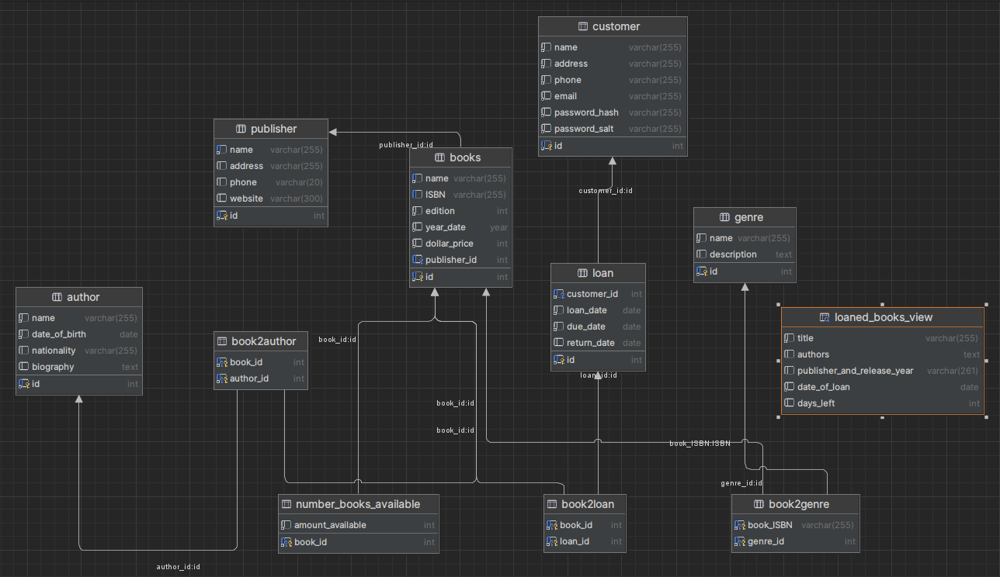

# MySQL Library Management System Database

This MySQL database is designed to manage a library's collection of books, loans, customers, and the relationships between them. It also includes stored procedures for common database operations and a folder for connecting the database to a .NET application.

## Tables

1. **author**: Contains information about authors: name, date of birth, nationality, biography. Primary key is ID.
  
3. **books**: Contains information about each book in the library, such as title, ISBN, edition, year of publishing, price. Primary key is ID.

4. **loans**: Tracks loans made to customers, including loan date, due date, return date. Primary key is ID. 

5. **genre**: Contains info about each customer: home address, name, phone, email, password hash and salt. Primary key is ID.

6. **book2loan**: Represents the many-to-many relationship between books and loans, linking each Book ID to its Loan ID.
   Foreign Key constraint: Book ID refers the ID column in books table;
   Foreign Key constraint: Loan ID refers the ID column in loan table;

8. **book2genre**: Represents the many-to-many relationship between books and genres. Book ID to Genre ID.
   Foreign Key constraint: book ID refers the ID column in books table;
   Foreign Key constraint: genre ID references ID column in genre table;

10. **book2author**: Represents the many-to-many relationship between books and authors. Book ID to Author ID.
    Foreign Key constraint: book ID references the ID column in books table;
    Foreign Key constraint: author ID references the ID column in author table;

12. **customers**: Stores information about library customers, including customer ID, loan date, due date, return date. Primary key is ID.

13. **number_books_availablle**: Stores the information on how many books are avaolable at the moment. Book ID - positive INT value or zero.
    Foreign Key constraint: book ID references the ID column of books table.

## Files

1. FOLDER `db_creation_insertion_queries`: has three .sql files which enable tables creation and insertions to those tables as well as possible querries. 

2. FOLDER `pa4`: Contains two .sql files.
   `pa4_procedures.sql` stores routines/procedures which might be useful to add a new loan or closing the loan(meaning the customer brought back the book).
   `pa4_executions.sql` stores example of executions of those st. proc. 

5. FOLDER `pa_3_bonus`: has logic to connect the database to a .NET application, allowing for easy integration into a library management system software.

6. FOLDER `pa5`: has one .sql file
   `views.sql` has a view which outputs info about the books which are currently loaned in the format:
   
   title | comma-separated authors | <publisher>, <release year> | date of loan in format Mmm, dd yyyy | number of days to the end term |

4. FILE `pa3.sql`: Provides examples of additional querries to database.

## DataBase Schema

## Purpose

The primary purpose of this database is to efficiently manage a library's collection of books, loans, and customers. It provides a structured way to store and retrieve information, making it easier for librarians to track book availability, loan history, and customer details.

